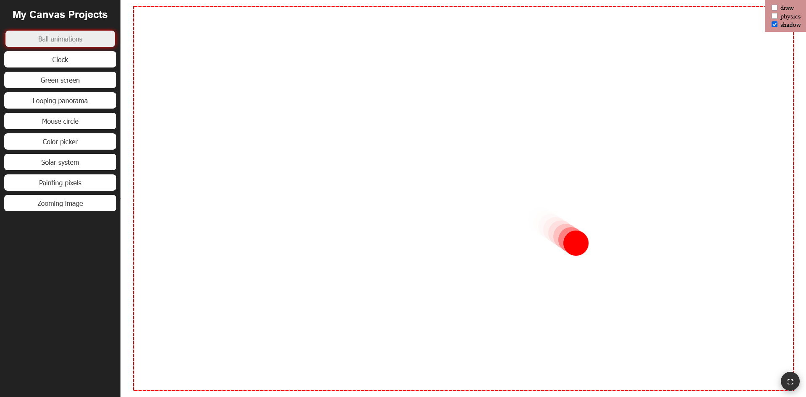

<h1>Canvas – JS Mini Projects</h1>

  

## About the Project
This repository contains **9 small exercises** exploring the **Canvas API in JavaScript**.  
The projects are inspired by the [MDN Canvas API tutorial](https://developer.mozilla.org/en-US/docs/Web/API/Canvas_API).  

I followed the tutorial but extended the exercises, making them more **advanced and creative**.

## How to Use
- Each subproject has its own folder with all required files (except images).  
- You can also open [`main.html`](main.html), which contains all projects in one place. 
  
---
*I recommend opening `main.html` and then using **full screen mode** for each exercise.*

> [!WARNING]  
> Some projects **will not work when opened directly as local files**.  
> This is because they load images dynamically, and the **browser blocks cross-origin requests (CORS)** for local files.  
> To avoid this issue, run the project with a local server (e.g. *Live Server* extension in VS Code).  

## Exercises Overview

| # | Project Name                                    | Description                                                |
|---|-------------------------------------------------|------------------------------------------------------------|
| 1 | [Ball Animation](ball-animation/index.html)     | Animations of a ball bouncing in the box.                  |
| 2 | [Clock](clock/index.html)                       | A clock with a few additional options.                     |
| 3 | [Green Screen](green-screen/index.html)         | Chroma key effect with video.                              |
| 4 | [Looping Panorama](looping-panorama/index.html) | Infinitly looping panorama, possible to scroll across.     |
| 5 | [Mouse Circle](mouse-circle/index.html)         | Particles running on a circle (inspired by Jack Rugile).   |
| 6 | [Color Picker](color-picker/index.html)         | Selects RGB code of the color from the pixel of the image. |
| 7 | [Solar System](solar-system/index.html)         | Solar system interactive simulation.                       |
| 8 | [Painting Pixels](painting-pixels/index.html)   | Greyscale, sepia and other effects made with canvas.       |
| 9 | [Zooming Image](zooming-image/index.html)       | Element shows zoomed image - one smoothed and another not.|

## Licenses
1. The project is based on the [**MDN Canvas API tutorial**](https://developer.mozilla.org/en-US/docs/Web/API/Canvas_API).  
2. The **Mouse Circle** project was inspired by [*Jack Rugile’s work on CodePen*](https://codepen.io/jackrugile/pen/kMWyeM).  

 
